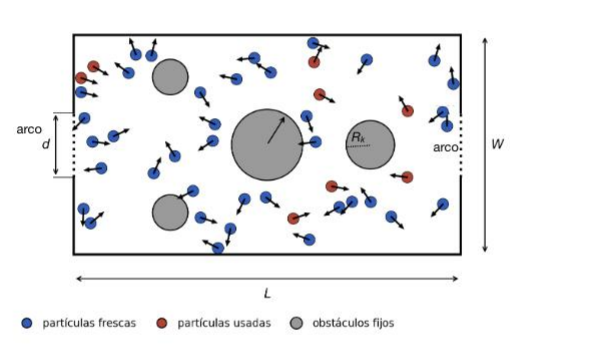

# Simulación de Sistemas

## Trabajo Práctico Nro. 3: Simulación Dirigida por Eventos

*(Enunciado publicado en CAMPUS el 07/09/2026)*

El sistema a simular, analizar y presentar se describe más abajo.

Se recuerda que la simulación debe generar un *output* en formato de archivo de texto. Luego el módulo de animación se ejecuta en forma independiente tomando estos archivos de texto como *input*. De esta forma la velocidad de la animación no queda supeditada a la velocidad de la simulación.

Los entregables del T.P. son:  
a- Presentación oral de 13 minutos de duración con las secciones indicadas en el documento ".../Formato_Presentaciones.pdf".  
b- El documento de la presentación en formato pdf. En las diapositivas con animaciones debe verse un fotograma representativo de la misma con su respectivo link explícito a youtube o vimeo (NO enviar archivos de animaciones, ni por medio de links, ni subirlos a campus, ni a drive, ni embebidos en el pdf).  
c- Archivo .zip con el código fuente implementado. Unicamente incluir la versión final del motor de simulación (no incluir versiones previas, ni código de postprocesamiento, ni outputs, ni figuras, ni resultados, ni ninguna documentación extra). **Este archivo debe ser menor a 100 KB.**  
d- Archivo de texto con la configuración de obstáculos elegida para la competencia (ver la sección "Competencia" al final de este enunciado).

**Al preparar los entregables, seguir los lineamientos establecidos en las Guías de Formato.**

***Fecha y Forma de Entrega:***

La presentación en pdf (b), el código fuente (c) y la configuración (d) deberán ser presentados **a través de campus**, antes del día 28/09/2026 a las 13 hs. Los archivos deben nombrarse de la siguiente manera:  
**"SdS_TP3_2026Q2GXXCSS_Presentación.pdf", "SdS_TP3_2026Q2GXXCSS_Codigo.zip" y "SdS_TP3_2026Q2GXXCSS_Config.txt", donde XX es el número de grupo y SS es la comisión ("S" or "S2").**

## Problema: *Billar-Metegol*

Utilizar dinámica molecular regida por eventos para partículas que siguen en movimiento rectilíneo uniforme entre colisiones. Las simulaciones tendrán un \(t_e\) intrínseco variable que dependerá de cuando sucedan los eventos. Imprimir el estado del sistema (posiciones, velocidades y *color* de las partículas) en cada uno de esos \(t_e\) (o mejor cada un número entero de eventos, para no llenar el disco rígido) para luego realizar animaciones y los correspondientes análisis.

Considerar un dominio de simulación rectangular de largo \(L = 1.20\) m y ancho \(W = 0.68\) m (las proporciones de una mesa de metegol), con paredes fijas e indeformables. Sobre el centro de cada una de las paredes cortas (\(x = 0\) y \(x = L\)) se define un segmento de longitud \(d = 0.20\) m que llamaremos *arco*. Dentro del dominio se ubican \(n\) obstáculos circulares fijos (de masa infinita), de radios \(R_k\) y centros \((x_k,y_k)\), tal como se ilustra en la Fig. 1.

**Figura 1:** Esquema del sistema a simular. Las partículas frescas (azules) se convierten en usadas (rojas) al tocar por primera vez uno de los arcos. El número, los radios y las posiciones de los obstáculos son parámetros libres.

Considerar \(N\) partículas de radio \(r = 0.0175\) m y masa \(m = 0.025\) kg, ubicadas aleatoriamente dentro del dominio sin solaparse entre sí ni con los obstáculos, con velocidades iniciales de módulo \(v_0 = 1\) m/s y ángulo de las direcciones distribuidos uniformemente en el intervalo \([0, 2\pi)\). Todas las colisiones (partícula-partícula, partícula-obstáculo y partícula-pared) son elásticas.

Todas las partículas comienzan en estado **"fresca"** (azul). Cuando una partícula fresca colisiona contra una pared corta en un punto de contacto que pertenece al arco, es decir \(|y - W/2| \leq d/2\), se contabiliza un **gol** y la partícula pasa al estado **"usada"** (roja). Sólo se cuenta el primer contacto: una partícula usada nunca vuelve a ser fresca ni vuelve a sumar goles, pero sigue moviéndose y colisionando normalmente, de manera que \(N\) y la densidad del sistema permanecen constantes.

Definimos \(N_g(t)\) como el número acumulado de goles, \(F_u(t) = N_g(t) / N\) como la fracción de partículas usadas, y \(t_{90}\) como el tiempo en el cual \(F_u\) alcanza el valor 0.9. **El objetivo del trabajo es encontrar y justificar la configuración de obstáculos que minimiza \(< t_{90} >\).**

### 1.1) Tiempo de ejecución en función de \(N\).

Para el sistema sin obstáculos, simular durante un tiempo absoluto fijo \(t_f = 30\) s, para distintos números de partículas \(N\) realizando al menos 10 realizaciones para cada \(N\). Graficar el tiempo de ejecución promedio en función de \(N\) incluyendo su desvío estándar.

### 1.2) Exploración del espacio de configuraciones.

**Para el punto 1.2 y los siguientes considerar \(N=100\) partículas.**

La configuración de obstáculos queda definida por el número \(K\) y por los parámetros \((x_k,y_k,R_k)\) de cada uno, sujetos a las siguientes restricciones:  
i. Crear \(K>0\) obstáculos íntegramente dentro del dominio y sin solaparse entre sí.  
ii. \(R_k \geq r\) y tal que permita la generación de las \(N\) partículas.

El objetivo de este punto es encontrar la configuración que minimiza \(< t_{90} >\) y justificar como se la encontró.  
Para ello pueden usar la metodología a elección, por ejemplo: Explorar sistemáticamente un único obstáculo grande desplazándose sobre el eje longitudinal; \(n\) obstáculos de área total fija con \(n\) creciente; arreglos tipo embudo hacia los arcos, etc. Para este tipo de exploración simular al menos 5 realizaciones y reportar \(< t_{90} >\) con su barra de error vs la variable estudiada. Comparar contra la mesa vacía.  
Otro ejemplo de metodología (opcional) sería implementar una búsqueda automática sobre el espacio de parámetros (búsqueda aleatoria, recocido simulado, algoritmo genético u otra).

### 1.3) Coeficiente de difusión.

Calcular el desplazamiento cuadrático medio (DCM) **promediando sobre todas las partículas móviles** del sistema (frescas y usadas) para una realización. Luego ajustar linealmente siguiendo las indicaciones del método mostrado en la clase Teórica 0 para obtener el coeficiente de difusión (\(D\)).  
Reportar \(D\) para la mesa vacía y para las otras configuraciones estudiadas, y verificar si existe o no alguna correlación entre \(D\) y \(< t_{90} >\).

### 1.4) Competencia

El día de la presentación (28/09/2026) se realizará una competencia en vivo entre los grupos. Cada grupo correrá, con su propio motor de simulación, **5 realizaciones** de su mejor configuración con los siguientes parámetros fijos: \(N = 100\), \(v_0 = 1\) m/s, \(r = 0.0175\) m, \(m = 0.025\) kg, \(L = 1.20\) m, \(W = 0.68\) m, \(d = 0.20\) m y \(t_{max} = 100\) s.

La condición inicial de las posiciones de las partículas debe ser a azar en toda el área disponible, para asegurarnos que así sea, antes de empezar la primera simulación se deberán generar algunas condiciones iniciales y, cuando los docentes lo indiquen, empezar con las simulaciones.  
El ranking se establece por el menor valor de \(< t_{90} >\) promediado sobre las 5 realizaciones. Si una configuración no alcanza el 90% de partículas usadas antes de \(t_{max}\), se la ubica al final del ranking y se la ordena por el número promedio de goles alcanzado a \(t_{max}\).  
La configuración debe entregarse junto con los demás entregables en un archivo de texto con una línea por obstáculo, con el formato "\(x_k\ y_k\ R_k\)" (en metros, separados por espacios). La configuración presentada en la competencia debe ser la misma que se entregó y debe cumplir las restricciones (i) y (ii) del punto 1.2.
